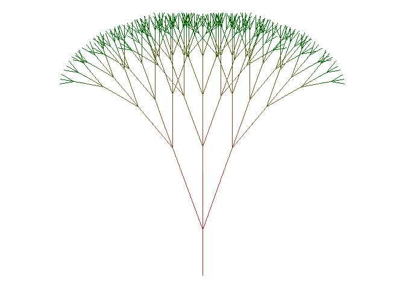

<!-- README.md is generated from README.Rmd. Please edit that file -->

# fractaltree

The goal of fractaltree is to plot trees as fractals. Using the shape of
a single “leaf”, every subsequent growht takes the same shape.


## Installation

``` r
devtools::install_github("andrie/fractaltree")
```

## Example

You can use the `depth` argument to change the number of growth cycles,
and the `shrinkage_factor` to control how much growth with every
generation. If the growth is high, the resulting image may resemble a
shrub, and if the growth is low, the resulting image may resemble a
mature tree.

``` r
fractal_tree(leaf, depth = 5, growth_fraction = 1) %>% 
  plot_tree()
```


``` r

fractal_tree(leaf, depth = 5, growth_fraction = 0.75) %>% 
  plot_tree()
```



``` r

fractal_tree(leaf, depth = 5, growth_fraction = 0.5) %>% 
  plot_tree()
```


You can make interesting tree shapes if the leaf shape is asymmetric:

``` r
leaf <- local({
  matrix(
    c(0, 0, 0, 1,
      0, 0.45, 0.12, 0.80,
      0, 0.85, -0.04, 0.95),
    byrow = TRUE, ncol = 4
  )
})

leaf %>% 
  fractal_tree(depth = 1) %>% 
  plot_tree()
```


``` r

leaf %>% 
  fractal_tree(depth = 7, growth_fraction = 0.6) %>% 
  plot_tree()
```


## Translate, rotate and grow

You can use the functions `translate()`, `rotate()` and `shrink()` to
perform spatial transformation on a tree.

## Kaleidoscope

In addition you can use the `kaleidoscope()` function to turn a tree
into a symmetric diagram:

``` r
leaf %>% 
  fractal_tree(depth = 3, growth_fraction = 0.8) %>% 
  kaleidoscope() %>% 
  plot_tree(colors = c( "red", "blue"))
```


By first translating a tree in 2-dimensional space, using the
`translate()` function, you can create very interesting `kaleidoscope()`
images:

``` r
leaf %>% 
  fractal_tree(depth = 3, growth_fraction = 0.8) %>% 
  kaleidoscope() %>% 
  translate(c(0, 5)) %>% 
  kaleidoscope() %>% 
  plot_tree(colors = c( "red", "blue"))
```


